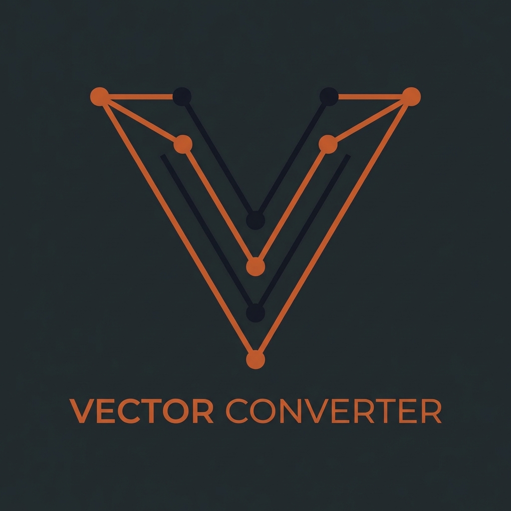

<p align="center">
  
</p>

# Versor

**Versor** is a local web application designed to transform raster images (PNG, JPG, BMP, GIF) into clean, optimized SVG vectors. 

While it's a versatile tool for any vectorization task, it is specifically fine-tuned for **CNC machining, laser cutting, and engraving workflows**, providing specialized tracing methods that standard converters often lack.


## Features

- **Specialized Tracing**: Choose between Outline, Centerline, or Color/Detail tracing based on your specific fabrication needs.
- **CNC Optimized**: Presets designed for toolpath generation, ensuring clean curves and minimal nodes.
- **Privacy First**: Runs entirely on your local machine; no images are ever uploaded to a third-party server.
- **Modern UI**: A responsive, dark-mode interface with real-time side-by-side previews.

## Tracing Methods

| Method | Best For | How It Works |
|--------|----------|--------------|
| **Potrace** | CNC cutting, silhouettes | Traces clean outlines around shapes |
| **Centerline** | Engraving, line art, text | Traces single-line paths through the middle of strokes |
| **vtracer** | Color artwork, illustrations | Preserves colors and layers for complex graphics |

Each method comes with pre-configured presets—like **CNC Precise**, **Technical**, or **Pixel Art**—plus granular custom controls for power users.

## Requirements

- Python 3.10+
- [ImageMagick](https://imagemagick.org/) (required)
- [Potrace](http://potrace.sourceforge.net/) (required)
- [Autotrace](http://autotrace.sourceforge.net/) (optional, for centerline mode)
- [vtracer](https://github.com/visioncortex/vtracer) (optional, for color tracing)

Or just use Docker and skip the dependency hassle.

## Quick Start

### Docker (Quick Start)

The easiest way to run Versor is to use Docker.

1.  **Clone the repository** (or just download `docker-compose.yml`).
2.  **Run the application**:
    ```bash
    docker compose up -d
    ```

Docker will automatically pull the pre-built image from the GitHub Container Registry. Once it's running, open http://localhost:5555 in your browser.

### Docker (Development / Local Build)

If you prefer to run the image directly without downloading any files:

```bash
docker run -d -p 5555:5000 --name versor ghcr.io/zheroz00/versor:latest
```

### Local

Install the external tools first, then: (Use uv or pip)

```bash
uv venv
source .venv/bin/activate
uv pip install -r requirements.txt
python app.py
```

Open http://localhost:5000 in your browser.

### Windows

PowerShell scripts are included for convenience:

```powershell
.\Start-Versor.ps1   # Start server and open browser
.\Stop-Versor.ps1    # Stop server
```

## Configuration

Tool paths can be set via environment variables:

| Variable | Default | Description |
|----------|---------|-------------|
| `POTRACE_PATH` | `/usr/bin/potrace` | Path to potrace binary |
| `AUTOTRACE_PATH` | `/usr/bin/autotrace` | Path to autotrace binary |
| `VTRACER_PATH` | `/usr/local/bin/vtracer` | Path to vtracer binary |
| `FLASK_HOST` | `127.0.0.1` | Bind address |
| `FLASK_DEBUG` | `true` | Enable debug mode |

## How It Works

```
Potrace:    Image → ImageMagick (threshold) → Potrace → SVG
Centerline: Image → ImageMagick (threshold) → Autotrace → SVG
vtracer:    Image → vtracer (direct) → SVG
```

The web UI shows a side-by-side comparison of the original image and the converted SVG.

## Project Structure

```
Versor/
├── app.py                 # Flask routes
├── config.py              # Tool paths and folders
├── presets.py             # Preset configurations
├── converters/            # Conversion logic
│   ├── potrace.py
│   ├── centerline.py
│   ├── vtracer.py
│   └── dependencies.py
├── static/                # CSS and JavaScript
├── templates/             # HTML templates
├── Dockerfile
└── docker compose.yml
```

## License

This project is licensed under the [Business Source License 1.1](LICENSE).

- **Non-Commercial Use:** Free for individuals, hobbyists, and educational purposes.
- **Commercial Use:** Restricted until the Change Date.
- **Change Date:** 2029-01-10.
- **Change License:** Apache License, Version 2.0.

After the Change Date, the software automatically becomes fully Open Source under the Apache 2.0 license.

## Contributing

Issues and pull requests welcome. This is a personal project, so response times may vary.

## Support

I built this tool to solve a specific problem in my own workflow. If it ends up saving you some time in your shop or studio, feel free to support the project. I’m just glad to see it getting some use.

[](https://www.buymeacoffee.com/zheroz00)
